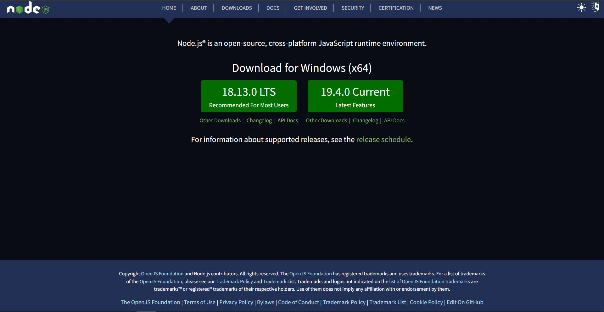
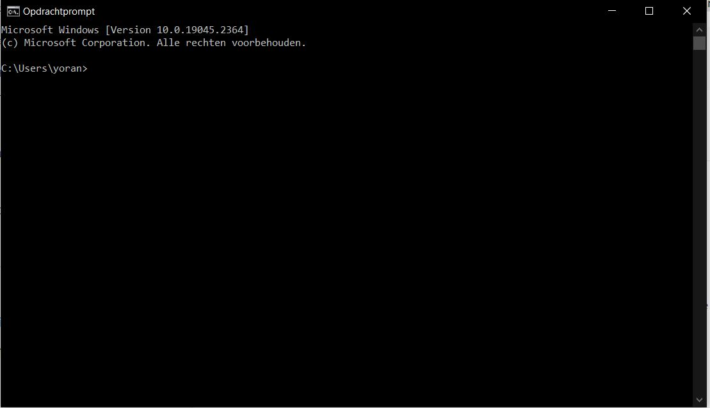
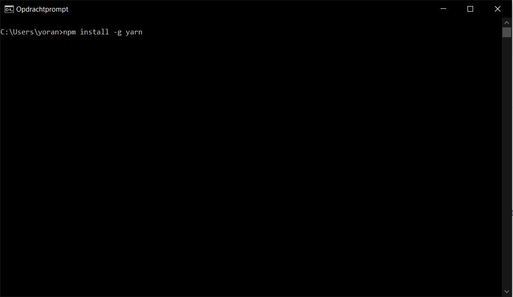

# STEAM-clubs 2022-2022 Web Development
Deze tutorial is bedoeld voor de deelnemers van de Web Development reeks van de STEAM-clubs in het schooljaar 2022-2023. De tutorial is bedoeld om de deelnemers te helpen bij het installeren van de benodigde software voor de reeks. De tutorial is opgesteld voor Windows 10, maar de meeste software is ook beschikbaar voor andere besturingssystemen.

- [STEAM-clubs 2022-2022 Web Development](#steam-clubs-2022-2022-web-development)
- [Visual Studio Code](#visual-studio-code)
  - [Extensies voor Visual Studio Code](#extensies-voor-visual-studio-code)
- [Browsers](#browsers)
- [nodejs](#nodejs)
- [Yarn](#yarn)
- [Extra info](#extra-info)
- [Problemen](#problemen)

# Visual Studio Code

Visual Studio Code is de editor die we gaan gebruiken voor de reeks. Het is een gratis editor die beschikbaar is voor Windows, Linux en macOS. Je kan Visual Studio Code downloaden op de [Visual Studio Code website](https://code.visualstudio.com/Download).

Je kan de gepaste versie voor jouw besturingssysteem downloaden. Het handigste is om gewoon op de grote blauwe downloadknop te drukken onder het voor jouw besturingssysteem geschikte bestand. (Vermoedelijk is dit Windows).

 

Open het gedownloade bestand.

Je krijgt dan volgend venster te zien. Hier moet je de taal kiezen. Nederlands is nog niet beschikbaar dus kies best voor Engels om verder te gaan. Klik dan op `Ok`.


Op de volgende pagina volgt de licentieovereenkomst. Lees deze even door en duid dan `I accept the agreement` aan. Klik dan op `Next`.


Dan komt het venster met de keuze voor de locatie van de installatie. Klik op `Next`.


Dan komt u op volgend scherm. Klik op `Next`.


In het volgende scherm kan u kiezen of u een snelkoppeling naar de editor wil op het bureaublad. Dit is handig maar niet noodzakelijk. De opties `Add "Open with Code" action to Windows file context menu` en `Add "Open with Code" action to Windows directory context menu` zijn ook handig maar niet noodzakelijk. Dit is aan te raden als je van plan bent buiten de sessies ook veel projectjes te maken. Het zorgt er voor dat je vanuit je bestanden het project kan openen in Visual Studio Code Klik op `Next`.


Tot slot komt u op het overzichtscherm. Klik hier op `Install`.


De installatie zal nu beginnen. Dit kan even duren. Wacht tot de installatie voltooid is. Dan kan je op `Finish` klikken.


Visual Studio Code zal nu openen. 


Zo nu heb je Visual Studio Code geïnstalleerd. We gaan nu nog enkele extensies installeren.
 ## Extensies voor Visual Studio Code
 Visual Studio Code heeft enkele basis functies maar is vooral gebouwd op zijn extensies. Extensies zijn kleine functionaliteiten die extra toegevoegd kunnen worden aan VSC. Dit maakt het een handige editor voor verschillende programmeertalen. In deze reeks gaan we enkele extensies gebruiken. Deze kan je installeren via de extensie manager van VSC. Je kan deze openen door op de extensie knop te drukken in de zijbalk van VSC. Zoals je kan zien in de foto. Deze balk ziet er mogelijk een klein beetje anders uit.

  

Je krijgt dan volgend scherm te zien.


Zoals je ziet heb ik al heel wat existensies geïnstalleerd. Dit is niet nodig voor de reeks. Je kan de extensies die je nodig hebt installeren door op de zoekbalk te klikken en de naam van de extensie in te typen. 
De extensies die je nodig hebt zijn:
- Live Server van Ritwick Dey. Druk op install.  
- Path Intellisense van Christian Kohler. Druk op install. 
- Error Lens van Alexander. Druk op install. 
  - Voor Error Lens moet er nog een beetje configuratie gedaan worden. Druk op de `F1` toets en zoek voor `preferences open user settings (json)`. Klik op enter. Dan krijg je volgend scherm te zien, het zal er waarschijnlijk anders uitzien aangezien ik al vaker dingen heb moeten aanpassen.  Voeg voor het laatst `}` de volgende code toe: 
```JSON 
   {
  "editor.codeActionsOnSave": {
    "source.fixAll": true
  },
  "[javascript]": {
    "editor.defaultFormatter": "HookyQR.beautify"
  },
  "errorLens.delay": 500,
  "errorLens.enabledDiagnosticLevels": [
      "error",
      "warning",
      "info"
  ],
  "errorLens.messageTemplate": "$severity $message $count ($source - $code)",
  "errorLens.severityText": [
      "❗️ ",
      "⚠️ ",
      "ℹ️ ",
      "💡 "
  ],
  "editor.bracketPairColorization.enabled": true,
  "security.workspace.trust.enabled": false
}
```

  
# Browsers
Voor de reeks hebben we een browser nodig die we kunnen gebruiken om onze webpagina's te testen. We gaan hiervoor Google Chrome gebruiken. Je kan deze downloaden op de [Google Chrome website](https://www.google.com/chrome/). Voor een klein deel is het echter handiger om Firefox Developer te gebruiken. Deze kan je downloaden op de [Mozilla Firefox website](https://www.mozilla.org/nl/firefox/developer/). Wil je deze niet installeren dan is dat geen probleem. Het is niet nodig om de reeks te volgen, maar wel handig.

Opzich maakt het niet heel veel uit welke je gebruikt. Elke browser kan in principe gebruikt worden, het hangt dus deels af van je eigen voorkeur. Weet je niet wat kiezen? Dan kan je misschien voor Firefox gaan dan moet je niet veranderen van browser. 
 

# nodejs
NodeJs is een JavaScript runtime environent, wat dat precies is moet je je niet aantrekken. Het is een programma dat je nodig hebt om JavaScript te kunnen uitvoeren. We gaan dit gebruiken om onze webpagina's te testen. Je kan deze downloaden op de [nodejs website](https://nodejs.org/en/). Kies voor de LTS versie (18.xx.x op het moment van schrijven van deze tutorial).


Open het bestand dat werd gedownload. Je krijgt de startpagina van de installatie te zien. Druk op `Next`.


Daarna krijg je de licentieovereenkomst te zien. Lees deze even door. Als je akkoord gaat met de voorwaarden kan je op `I accept the terms in the license agreement` klikken en dan op `Next`.

  

Dan krijg je de installatie locatie te zien. Hier kan je de installatie locatie aanpassen. Dit is niet nodig. Druk op `Next`.


Vervolgens krijg je de installatie opties te zien. Hier kan je kiezen of je de installatie wil aanpassen. Dit is niet nodig. Druk op `Next`.


We komen nu op het scherm 'tools for native modules' te zien. Duid hier NIET `Automatically install the necessary tools` aan. Druk op `Next`. (opgelet dit is aangeduid in de screenshot maar moet dus NIET aangeduid worden)


Tot slot krijg je een overzicht te zien van de installatie. Druk op `Install`.


De installatie zal nu beginnen. Dit kan even duren.
Het kan zijn dat je moet bevestigen dat de installatie mag uitgevoerd worden. Druk dan op `Yes`.

Als de installatie gelukt is krijg je volgend scherm te zien. Druk op `Finish`.


# Yarn

Nadien gaan we Yarn installeren. Yarn is een package manager. Dit is een programma dat je kan gebruiken om packages te installeren. Dit is handig om te gebruiken omdat je dan niet alle packages zelf moet downloaden. Je kan deze installeren via een command prompt. Dit is een programma dat je kan openen door op de Windows toets te drukken en dan `cmd` in te typen. Druk op enter. Je krijgt dan een zwart scherm te zien.





Typ in het zwarte scherm `npm install -g yarn`.

 Druk op enter. De installatie zal beginnen. Dit kan even duren. Als het gelukt is mag je de command prompt sluiten.

# Extra info 
Microsoft voorziet ook een goede interactieve [tutorial](https://learn.microsoft.com/nl-nl/training/modules/develop-web-apps-with-vs-code/). Hier leer je hoe je webapps kan ontwikkelen met Visual Studio Code.

# Problemen

Heb je problemen? Lukt het niet? Stuur dan een mailtje met een beschrijving van de problemen naar [jeugdwerking@fablaberpemere.be](mailto:jeugdwerking@fablaberpemere.be?subject=Problemen%20bij%20installatie%20software%20voor%20Web%20Development%20Steamclub%20reeks) En we helpen je zo snel mogelijk verder. 
Je kan ook langskomen op de eerste sessie vanaf 8u30. Dan helpen we je graag verder.