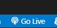

# Tips en tricks voor Visual Studio
## opstarten lifeserver
De lifeserver gebruiken we om onze website te kunnen tonen. Het handige is dat alles automatisch refreshet word. Dus als je een wijziging maakt in je code, dan zie je dat direct in de browser. Je hoeft dus niet steeds opnieuw te builden en opnieuw te starten. Dit is een handige tool om te gebruiken tijdens het ontwikkelen van je website.
om op te starten ga je naar een .html pagina en klik je met de rechtermuisknop. Kies dan voor "open with liveserver". Je ziet dan dat je browser automatisch opent en de pagina laadt. Als je nu een wijziging maakt in je code, dan zie je dat direct in de browser. Een andere mogelijkheid is rechts onder in visual studio op het icoontje klikken `go live`. 

## hulpmiddel
op ctrl+spatie kan je klikken om extra hulp te krijgen. Je krijgt dan voorstellen om aan te vullen,...