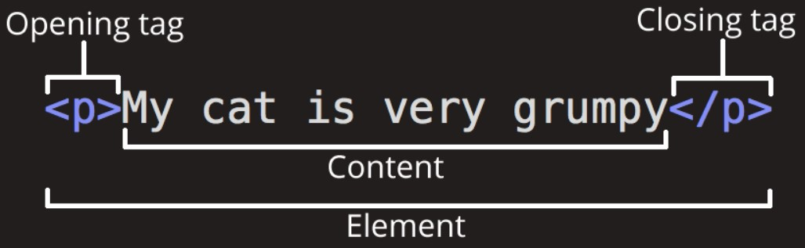
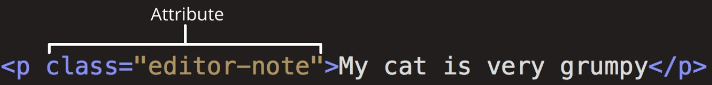
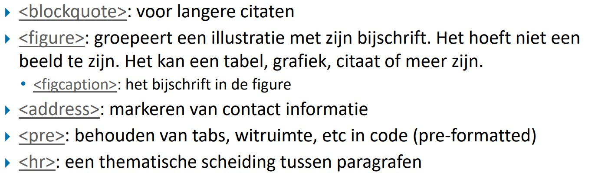
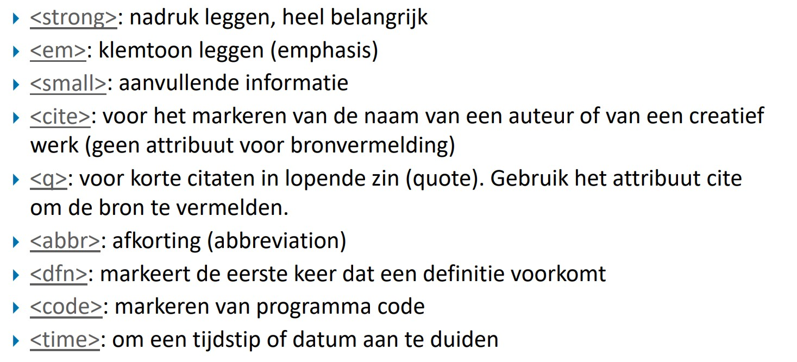
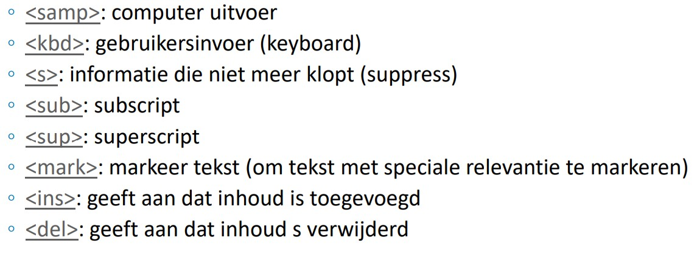
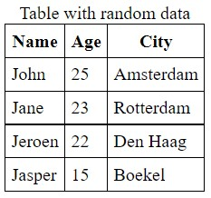
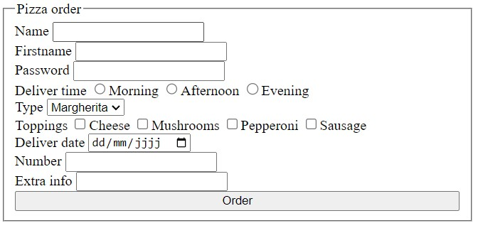

# STEAM-clubs 2022-2022 Web Development
Deze tutorial is bedoeld voor de deelnemers van de Web Development reeks van de STEAM-clubs in het schooljaar 2022-2023.
# Sessie 1 HTML Basics
## Inleiding
HTML beschrijft de structuur van je HTML document en de betekenis (semantiek) van de verschillende onderdelen.  
De drie belangrijkste begrippen zijn:
1. element
2. tag
3. attribute

## Tags en elementen


Er bestaan ook lege tags. `<br>` is daar een voorbeeld van. Het maakt voor HTML niet echt uit of je `</br>` of `<br>` gebruikt. Voor sommige frameworks op JavaScript (later meer) zoals React is dit wel belangrijk.   
Een voorbeeld:  
`<p>Welkom! <br> Bij STEAMCLUBS</p>`

Je kan ook meerdere tags in een element hebben die zorgen dan voor zogenaamde nested tags. Een lijst is een veelgebruikt voorbeeld hiervan. 
```html
    <ul>
      <li> Rijbewijs A</li>
      <li> Rijbewijs B</li>
      <li> Rijbewijs C</li>
    </ul>
```

## Attributen

Verder zijn er ook attributen dit zijn extra informatie die je in een opening of lege tag plaatst. Dit zorgt bevoorbeeld voor dat men dingen kan 


## HTML standaard elementen
De meest basis elementen:
- Koppen `<h1>` tot en met `<h6>`
- Paragraaf (stukje tekst): `<p>`
- Hyperlink (link naar andere pagina) `<a href="link">`
- Afbeelding: ``
- Form elementen (zie later)
- Lijsten `<ul>` voor ongeordende lijsten en `<ol> `voor geordende lijsten (genummerd)
  - `<li>` is een item in een lijst
- Description list` <dl>`
  - `<dt>` De term waarvoor een beschrijving nodig is en 
  - `<dd>` voor de beschrijving van een item

De andere zaken zullen duidelijk worden bij het gebruik. Heel veel kan je gewoon opzoeken op internet.

`<div>` dient om een soort van containers zie het als boxen waarbinnen tags kan plaatsen te maken. Dit zie je niet op je scherm verschijnen.\
`<span>` is een soort van container die je gewoon kan plaatsen. Dit is een soort van inline element. Wat betekent dat het niet op een volgende lijn komt zoals een div (wat een block element is) maar dat het op dezelfde lijn blijft. Je kan dus meerdere spans naast elkaar hebben. Zo is bv een img of een a tag ook inline elementen. Terwijl h1 en p zijn block elementen.
Deze zijn niet belangrijk voor de HTML, maar voor de CSS.


Er zijn nog heel wat andere elementen maar die zul je kunnen opzoeken meestal. Een kort overzicht:






Er blijven nog 2 belangrijke dingen over die we niet besproken hebben tot nu toe namelijk tabellen en formulieren. We gaan beginnen met tabellen:

## Tabellen


```html
    <table>
        <caption>
            Table with random data
        </caption>
        <tr>
            <th>Name</th>
            <th>Age</th>
            <th>City</th>
        </tr>
        <tr>
            <td>John</td>
            <td>25</td>
            <td>Amsterdam</td>
        </tr>
        <tr>
            <td>Jane</td>
            <td>23</td>
            <td>Rotterdam</td>
        </tr>
        <tr>
            <td>Jeroen</td>
            <td>22</td>
            <td>Den Haag</td>
        </tr>
        <tr>
            <td>Jasper</td>
            <td>15</td>
            <td>Boekel</td>
        </tr>
    </table>
  ```

  Een tabel bevat zoals je ziet veel verschillende tags we gaan ze van boven naar beneden doorlopen.
  - `<table>` is de tabel zelf dit is de buitenste tag en bevat alles van de tabel zelf.
  - `<caption>` is de titel van de tabel.
  - `<tr>` is een rij in de tabel.
  - `<th>` is een kop in de tabel.
  - `<td>` is een cel in de tabel.
  - `<th>` en `<td>` zijn gelijkvormig.
  

  ## Formulieren
  Formulieren zijn een soort van tabel waar je data in kan invullen. Deze zijn gebaseerd op de HTML5. 


  ```html
      <fieldset>
        <legend>Pizza order</legend>
        <form action="/order" method="post">
            <label for="name">Name
            <input type="text" name="name" id="name"></label>
            <label for="firstname">Firstname
            <input type="text" name="firstname" id="firstname"></label>
            <label for="password">Password
            <input type="password" name="password" id="password"></label>
            <label for="delivertime">Deliver time
            <input type="radio" name="delivertime" id="delivertime" value="morning">Morning
            <input type="radio" name="delivertime" id="delivertime" value="afternoon">Afternoon
            <input type="radio" name="delivertime" id="delivertime" value="evening">Evening</label>
            <label for="type">Type
            <select name="type" id="type">
              <option value="margherita">Margherita</option>
              <option value="hawaiian">Hawaiian</option>
              <option value="meat">Meat</option>
          </select></label>
            <label for="toppings">Toppings
            <input type="checkbox" name="toppings" id="toppings" value="cheese">Cheese
            <input type="checkbox" name="toppings" id="toppings" value="mushrooms">Mushrooms
            <input type="checkbox" name="toppings" id="toppings" value="pepperoni">Pepperoni
            <input type="checkbox" name="toppings" id="toppings" value="sausage">Sausage</label>
            <label for="deliverdate">Deliver date
            <input type="date" name="deliverdate" id="deliverdate"></label>
            <label for="aantal">Number
            <input type="number" name="aantal" id="aantal"></label>
            <label for="extra">Extra info
                          <input type="text" name="extra" id="extra"></label>
            <!--submit button-->
            <input type="submit" value="Order">
        </form>
    </fieldset>   
 ``` 
Opnieuw heel wat elementen maar geen nood we zullen ze bespreken
- `<fieldset>` is een box rond het formulier die je ziet op de screenshot.
- `<legend>` is de titel van de fieldset.
- `<form>` is het formulier zelf. Dit is de buitenste tag en bevat alles van de formulier zelf. Het is een tag die je kan gebruiken om data te verzenden. Deze tag heeft een action en een method. De action is de URL waar de data naar toe moet. De method is de manier waarop de data verzonden moet worden. Indien je meer wilt weten over die methoden dan moet je die maar eens opzoeken, er is heel veel info over te vinden. Voor de volledigheid een klein overzicht van de meestgebruikte methode:
  - `get`
  - `post`
  - `put`
  - `delete`
- `<label>` is een label voor een input. Het zegt wat er in de input moet komen. Het label heeft een for attribuut dit geeft aan voor welke input de label bedoelt is. Zo kan je bijvoorbeeld klikken op een label en word je naar de juiste input gestuurd.
- `<input>` is waar je al je input schrijft of geeft. Die kan verschillende attributen hebben. De belangrijkste zijn:
  - `type` is het type input. De verschillende types zijn:
    - text
    - password
    - radio (unieke selectie uit de keuzes)
    - checkbox is hetzelfde als een radio maar je kan meerdere aanduiden. 
    - date is een datum.
    - number is een getal.
    - submit dit is de knop gebruikt voor het indinen van het formulier.
    - ...
  - `name` geeft de naam van het input
  - `id` is het id van de input (dit is een unieke naam voor de input) en dit is een vereiste attribuut.
  - `value` dient om een standaard waarde mee te geven
  - `checked` dient voor checkboxes al dan niet standaard aangevinkt te zijn.
  - `disabled` is een attribuut die er voor zorgt dat je het niet kan invullen.
  - `required` is een attribuuut die aangeeft dat de input verplicht is.
  - `autofocus` is een attribuut dat aangeeft dat de input automatisch moet worden aangeduid.
  - `min` en `max` zijn voor inputs die een waarde hebben.
  - `step` is voor inputs die een waarde hebben. Je geeft hiermee aan per hoeveel het vermeerderd word
  - `placeholder` is voor inputs die leeg zijn. Het zegt wat er in de input moet komen.
- `<select>` is een selectie. Het wordt altijd gebruikt in samenwerking met een `<option>` tag. die geeft de beschikbare opties weer.


