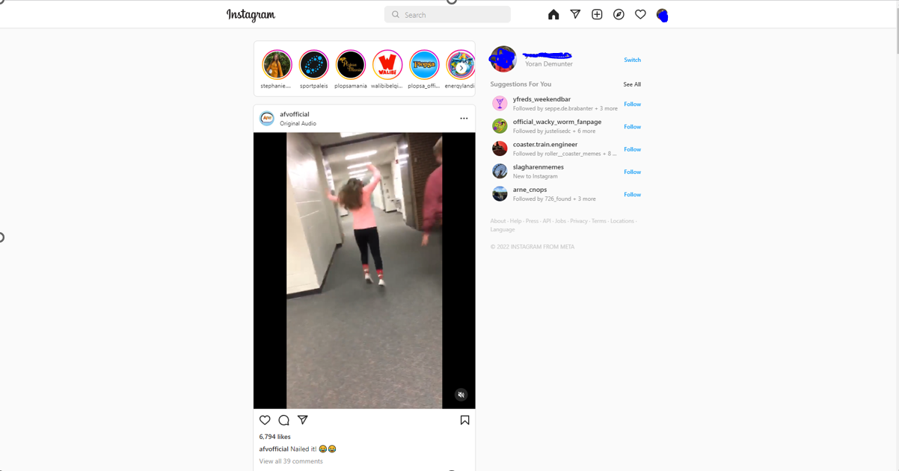
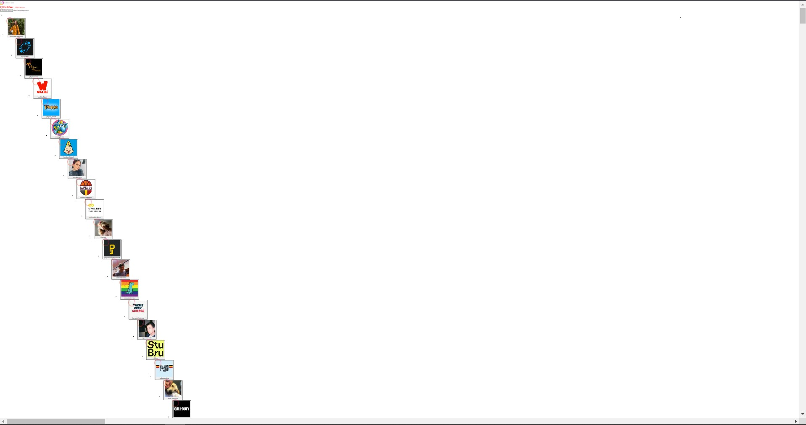
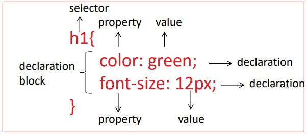

# STEAM-clubs 2022-2022 Web Development
Deze tutorial is bedoeld voor de deelnemers van de Web Development reeks van de STEAM-clubs in het schooljaar 2022-2023.
- [STEAM-clubs 2022-2022 Web Development](#steam-clubs-2022-2022-web-development)
- [Sessie 1: deel 1 HTML Basics](#sessie-1-deel-1-html-basics)
  - [Inleiding](#inleiding)
  - [Tags en elementen](#tags-en-elementen)
  - [Attributen](#attributen)
  - [HTML standaard elementen](#html-standaard-elementen)
  - [Tabellen](#tabellen)
  - [Formulieren](#formulieren)
  - [Onze eigen website](#onze-eigen-website)
    - [Index.html](#indexhtml)
    - [ticketInfo.html](#ticketinfohtml)
    - [ticket.html](#tickethtml)
    - [contact.html](#contacthtml)
    - [login.html](#loginhtml)
    - [register.html](#registerhtml)
- [Sessie 1: deel 2 CSS Basics](#sessie-1-deel-2-css-basics)
  - [inleiding](#inleiding-1)
  - [CSS selectors](#css-selectors)
  - [Onze website.](#onze-website)
    - [Achtergrond](#achtergrond)
    - [Tekst](#tekst)
    - [Lijsten en navigatie](#lijsten-en-navigatie)
    - [De links](#de-links)
  - [CSS Grid](#css-grid)
# Sessie 1: deel 1 HTML Basics
## Inleiding
HTML beschrijft de structuur van je HTML document en de betekenis (semantiek) van de verschillende onderdelen.  
De drie belangrijkste begrippen zijn:
1. element
2. tag
3. attribute

## Tags en elementen


Er bestaan ook lege tags. `<br>` is daar een voorbeeld van. Het maakt voor HTML niet echt uit of je `</br>` of `<br>` gebruikt. Voor sommige frameworks op JavaScript (later meer) zoals React is dit wel belangrijk.   
Een voorbeeld:  
`<p>Welkom! <br> Bij STEAMCLUBS</p>`

Je kan ook meerdere tags in een element hebben die zorgen dan voor zogenaamde nested tags. Een lijst is een veelgebruikt voorbeeld hiervan. 
```html
    <ul>
      <li> Rijbewijs A</li>
      <li> Rijbewijs B</li>
      <li> Rijbewijs C</li>
    </ul>
```

## Attributen

Verder zijn er ook attributen dit zijn extra informatie die je in een opening of lege tag plaatst. Dit zorgt bevoorbeeld voor dat men dingen kan 


## HTML standaard elementen
De meest basis elementen:
- Koppen `<h1>` tot en met `<h6>`
- Paragraaf (stukje tekst): `<p>`
- Hyperlink (link naar andere pagina) `<a href="link">`
- Afbeelding: ``
- Form elementen (zie later)
- Lijsten `<ul>` voor ongeordende lijsten en `<ol> `voor geordende lijsten (genummerd)
  - `<li>` is een item in een lijst
- Description list` <dl>`
  - `<dt>` De term waarvoor een beschrijving nodig is en 
  - `<dd>` voor de beschrijving van een item

De andere zaken zullen duidelijk worden bij het gebruik. Heel veel kan je gewoon opzoeken op internet.

`<div>` dient om een soort van containers zie het als boxen waarbinnen tags kan plaatsen te maken. Dit zie je niet op je scherm verschijnen.\
`<span>` is een soort van container die je gewoon kan plaatsen. Dit is een soort van inline element. Wat betekent dat het niet op een volgende lijn komt zoals een div (wat een block element is) maar dat het op dezelfde lijn blijft. Je kan dus meerdere spans naast elkaar hebben. Zo is bv een img of een a tag ook inline elementen. Terwijl h1 en p zijn block elementen.
Deze zijn niet belangrijk voor de HTML, maar voor de CSS.


Er zijn nog heel wat andere elementen maar die zul je kunnen opzoeken meestal. Een kort overzicht:


Er blijven nog 2 belangrijke dingen over die we niet besproken hebben tot nu toe namelijk tabellen en formulieren. We gaan beginnen met tabellen:

## Tabellen


```html
    <table>
        <caption>
            Table with random data
        </caption>
        <tr>
            <th>Name</th>
            <th>Age</th>
            <th>City</th>
        </tr>
        <tr>
            <td>John</td>
            <td>25</td>
            <td>Amsterdam</td>
        </tr>
        <tr>
            <td>Jane</td>
            <td>23</td>
            <td>Rotterdam</td>
        </tr>
        <tr>
            <td>Jeroen</td>
            <td>22</td>
            <td>Den Haag</td>
        </tr>
        <tr>
            <td>Jasper</td>
            <td>15</td>
            <td>Boekel</td>
        </tr>
    </table>
  ```

  Een tabel bevat zoals je ziet veel verschillende tags we gaan ze van boven naar beneden doorlopen.
  - `<table>` is de tabel zelf dit is de buitenste tag en bevat alles van de tabel zelf.
  - `<caption>` is de titel van de tabel.
  - `<tr>` is een rij in de tabel.
  - `<th>` is een kop in de tabel.
  - `<td>` is een cel in de tabel.
  - `<th>` en `<td>` zijn gelijkvormig.
  

  ## Formulieren
  Formulieren zijn een soort van tabel waar je data in kan invullen. Deze zijn gebaseerd op de HTML5. 


  ```html
      <fieldset>
        <legend>Pizza order</legend>
        <form action="/order" method="post">
            <label for="name">Name
            <input type="text" name="name" id="name"></label>
            <label for="firstname">Firstname
            <input type="text" name="firstname" id="firstname"></label>
            <label for="password">Password
            <input type="password" name="password" id="password"></label>
            <label for="delivertime">Deliver time
            <input type="radio" name="delivertime" id="delivertime" value="morning">Morning
            <input type="radio" name="delivertime" id="delivertime" value="afternoon">Afternoon
            <input type="radio" name="delivertime" id="delivertime" value="evening">Evening</label>
            <label for="type">Type
            <select name="type" id="type">
              <option value="margherita">Margherita</option>
              <option value="hawaiian">Hawaiian</option>
              <option value="meat">Meat</option>
          </select></label>
            <label for="toppings">Toppings
            <input type="checkbox" name="toppings" id="toppings" value="cheese">Cheese
            <input type="checkbox" name="toppings" id="toppings" value="mushrooms">Mushrooms
            <input type="checkbox" name="toppings" id="toppings" value="pepperoni">Pepperoni
            <input type="checkbox" name="toppings" id="toppings" value="sausage">Sausage</label>
            <label for="deliverdate">Deliver date
            <input type="date" name="deliverdate" id="deliverdate"></label>
            <label for="aantal">Number
            <input type="number" name="aantal" id="aantal"></label>
            <label for="extra">Extra info
                          <input type="text" name="extra" id="extra"></label>
            <!--submit button-->
            <input type="submit" value="Order">
        </form>
    </fieldset>   
 ``` 
Opnieuw heel wat elementen maar geen nood we zullen ze bespreken
- `<fieldset>` is een box rond het formulier die je ziet op de screenshot.
- `<legend>` is de titel van de fieldset.
- `<form>` is het formulier zelf. Dit is de buitenste tag en bevat alles van de formulier zelf. Het is een tag die je kan gebruiken om data te verzenden. Deze tag heeft een action en een method. De action is de URL waar de data naar toe moet. De method is de manier waarop de data verzonden moet worden. Indien je meer wilt weten over die methoden dan moet je die maar eens opzoeken, er is heel veel info over te vinden. Voor de volledigheid een klein overzicht van de meestgebruikte methode:
  - `get`
  - `post`
  - `put`
  - `delete`
- `<label>` is een label voor een input. Het zegt wat er in de input moet komen. Het label heeft een for attribuut dit geeft aan voor welke input de label bedoelt is. Zo kan je bijvoorbeeld klikken op een label en word je naar de juiste input gestuurd.
- `<input>` is waar je al je input schrijft of geeft. Die kan verschillende attributen hebben. De belangrijkste zijn:
  - `type` is het type input. De verschillende types zijn:
    - text
    - password
    - radio (unieke selectie uit de keuzes)
    - checkbox is hetzelfde als een radio maar je kan meerdere aanduiden. 
    - date is een datum.
    - number is een getal.
    - submit dit is de knop gebruikt voor het indinen van het formulier.
    - ...
  - `name` geeft de naam van het input
  - `id` is het id van de input (dit is een unieke naam voor de input) en dit is een vereiste attribuut.
  - `value` dient om een standaard waarde mee te geven
  - `checked` dient voor checkboxes al dan niet standaard aangevinkt te zijn.
  - `disabled` is een attribuut die er voor zorgt dat je het niet kan invullen.
  - `required` is een attribuuut die aangeeft dat de input verplicht is.
  - `autofocus` is een attribuut dat aangeeft dat de input automatisch moet worden aangeduid.
  - `min` en `max` zijn voor inputs die een waarde hebben.
  - `step` is voor inputs die een waarde hebben. Je geeft hiermee aan per hoeveel het vermeerderd word
  - `placeholder` is voor inputs die leeg zijn. Het zegt wat er in de input moet komen.
- `<select>` is een selectie. Het wordt altijd gebruikt in samenwerking met een `<option>` tag. die geeft de beschikbare opties weer.


## Onze eigen website
We gaan nu samen een eigen website maken. Maak je geen zorgen als hij er nog niet mooi uit ziet... We gaan eerst de funderingen opzetten (HTML) en later gaan we de site verder bouwen met CSS en Javascript, dat zal voor een volgende sessie zijn.

We gaan een website maken voor tickets te kopen voor een vlucht of een wedstrijd of evenement.

In ons voorbeeld maken we een wedstrijd, je kan zelf kiezen wat je exact wilt doen...

### Index.html
We beginnen met de homepagina. Deze moet verplicht index.html noemen. De reden hiervoor is dat je webserver die file zal zoeken bij het opzoeken van de website. Met andere woorden als je website online staat op https://www.besteWebDesigner.be dan zal bij het ingeven van die url automatisch de index.html file gezocht worden.
Maak een folder aan met als naam de naam van je website. Daarin maak je een html bestand aan index.html.
Een standaard HTML bestand ziet er altijd hetzelfde uit. Je kan dit doen door de knop `!` te typen en dan op het eerste voorstel te klikken. Werkt dit niet kan je ook onderstaande selecteren en plakken:
```html
<!DOCTYPE html>
<html lang="en">
<head>
  <meta charset="UTF-8">
  <meta http-equiv="X-UA-Compatible" content="IE=edge">
  <meta name="viewport" content="width=device-width, initial-scale=1.0">
  <title>Document</title>
</head>
<body>
  
</body>
</html>
``` 
Het eerste dat we gaan doen is de taal aanpassen. In de openingstag van html zie je `lang="en"` dit mag je aanpassen naar `lang="nl-BE"` of gewoon `lang="nl"`. Het is niet verplicht, maar het is een goede manier om de taal te geven, dit vooral voor blinden en slechtzienden die een e-reader gebruiken. Verder gaan we de titel van de pagina aanpassen naar bijvoorbeeld *home|ticketShop*

We gaan beginnen met de header. Deze zal op elke pagina terug komen en bevat de titel van de website, het logo en de navigatie.

Je maakt eerst een `<header></header>` tag aan. Hierin plaats je een titel en een logo. De titel gaan we h1 maken en de logo gaan we een img maken, je kan een map aanmaken die img heet in de map waarin je werkt. Daarin plaats je dan de afbeelding met de naam naar keuze de src tag word dan `src="img/naamLogo.jpg"` bijvoorbeeld met naamLogo.jpg uiteraard aangepast naar jouw logo en bestand. Het alt is de tekst die komt als de afbeelding niet kan geladen worden, ook word die gelezen op ereaders. Je kan daar bijvoorbeeld *logo* schrijven. 

Verder gaan we een navigatie maken. We moeten naar home kunnen gaan, naar tickets, de bezoeker moet contact kunnen opnemen en ook inloggen/registreren moet mogelijk zijn. We gaan hiervoor een `<nav></nav>` tag maken. Hierin plaatsen we een ul met list items van anchor (`<li><a href=""></a></li>`). De anchor gaan we aanmaken met de naam van de pagina en de href is de url van de pagina. Hieronder kan je een voorbeeld zien van hoe het moet.


```html
    <header>
        <h1>TicketShop</h1>
        
        <nav>
            <ul>
                <li><a href="index.html">Home</a></li>
                <li><a href="ticket.html">Tickets</a></li>
                <li><a href="contact.html">Contact</a></li>
                <li><a href="login.html">Login</a></li>
                <li><a href="register.html">Register</a></li>
            </ul>
        </nav>
    </header>
``` 
Na de header die we gemaakt hebben en zullen hergebruiken in de andere pagina's gaan we nu de *main* maken dit is alle content van de pagina zelf.
We gaan werken met sections de eerste is de intro van de website en bevat een welkom en een tekstje over de website. De tweede section is dan een voorbeeld van een ticket.
Een ticket zit in een fieldset en bevat een titel (welke wedstrijd) een afbeelding, een korte beschrijving, de prijs en een knop om naar de productpagina te gaan om het ticket te bestellen. Hieronder in het voorbeeld zie je hoe dat gebeurt. Probeer dit zo goed mogelijk na te maken en begrijpen vooral wat er gebeurt.
```html
    <main>
        <section>
            <h1>Welcome to TicketShop</h1>
            <p>
                Lorem ipsum dolor sit amet consectetur adipisicing elit. Quisquam, quidem.
            </p>
        </section>
        <section>
            <h2>Uitgelicht</h2>
            <fieldset>
                <h3>ploegA-ploegB</h3>
                
                <p>description short</p>
                <p>ticketprijs: €42.50</p>
                <input type=button onClick="location.href='ticketInfo.html'" value='Meer info'>
            </fieldset>
        </section>
    </main>
```

### ticketInfo.html

Deze pagina bevat de informatie over het ticket. Hierin zie je de titel, de afbeelding, de beschrijving, de prijs en een knop om het ticket te bestellen.

De basis van deze pagina is dezelfde als altijd (je kan bijvoorbeeld index.html kopieren en alles in de main weg doen en de titel aanpassen.)

Verder bevat de main gewoon de titel, afbeelding, uitgebreide beschrijving, het aantal beschikbare tickets en de ticketprijs. Het speciale aan deze pagina is dat ze een input veld bevat voor het aantal tickets. Deze input veld geeft aan hoeveel tickets je wilt bestellen.

```html
    <main>
        <h3>ploegA-ploegB</h3>
        
        <p>description long</p>
        <p>tickets available: 596</p>
        <p>ticketprijs: €42.50</p>
        <!--input number amount to order-->
        <input type="number" name="amount" min="0" max="10" value="0">
        <input type=button onClick="location.href='ticketInfo.html'" value='koop'>
    </main>
```

### ticket.html
De basis van deze pagina is dezelfde als altijd (je kan bijvoorbeeld index.html kopieren en alles in de main weg doen en de titel aanpassen.)

Verder bevat de main van deze pagina verschillende wedstrijden. Ook die kan je kopieren uit de main van index.html en verschillende keren plakken in deze main. 

### contact.html
Opnieuw is de basis dezelfde.
Dit formulier bevat een naam, email en berichtvak. 
```html    
    <main>
        <!--Contact info form-->
        <form action="" method="post">
            <fieldset>
                <legend>Contact</legend>
                <label for="name">Name:</label>
                <input type="text" name="name" id="name" required>
                <label for="email">Email:</label>
                <input type="email" name="email" id="email" required>
                <label for="message">Message:</label>
                <textarea name="message" id="message" cols="30" rows="10" required></textarea>
                <input type="submit" value="Send">
            </fieldset>
        </form>
    </main>
```

### login.html
Opnieuw is de basis hetzelfde. 
Verder bestaat de main uit een formulier met username en password en een loginknop.
```html
        <form action="login.php" method="post">
            <fieldset>
                <legend>Login</legend>
                <label for="username">Username:</label>
                <input type="text" name="username" id="username">
                <label for="password">Password:</label>
                <input type="password" name="password" id="password">
                <input type="submit" name="submit" value="Login">
            </fieldset>
        </form>
```

### register.html
Opnieuw is de basis hetzelfde.
Verder bestaat de main uit een formulier een aantal input fields en een registerknop.
```html
        <form action="register.php" method="post">
            <fieldset>
                <legend>Register</legend>
                <label for="firstname">firstname:</label>
                <input type="text" name="firstname" id="firstname" required>
                <label for="lastname">lastname:</label>
                <input type="text" name="lastname" id="lastname" required>
                <label for="birthdate">Birthdate:</label>
                <input type="date" name="birthdate" id="birthdate" required>
                <label for="adress">Adress:</label>
                <input type="text" name="adress" id="adress" required>
                <label for="zipcode">Zipcode:</label>
                <input type="text" name="zipcode" id="zipcode" required>
                <label for="city">City:</label>
                <input type="text" name="city" id="city" required>
                <label for="country">Country:</label>
                <input type="text" name="country" id="country" required>
                <label for="phone">Phone:</label>
                <input type="text" name="phone" id="phone" required>
                <label for="username">Username:</label>
                <input type="text" name="username" id="username" required>
                <label for="password">Password:</label>
                <input type="password" name="password" id="password" required>
                <label for="password2">Repeat password:</label>
                <input type="password" name="password2" id="password2" required>
                <input type="submit" name="submit" value="Register">
                <!--ask birthdate and adress-->

            </fieldset>
        </form>
```
Dat ws de basis van onze website. Al een hele boterham maar het viel al bij al nog mee, nietwaar? 
___

# Sessie 1: deel 2 CSS Basics
## inleiding 
CSS wordt gebruikt voor de layout van een website. 
Zonder css zou het er allemaal niet zo mooi uit zien online. 
Om u een voorbeeld te geven heb ik hier 2 afbeeldingen geplaatst van dezelfde website. Instagram. De ene heeft CSS de andere niet. Zo zie je ook dat die storys opgebouwd zijn als buttons in een unorderd list.



CSS bestaat uit verschillende belangrijke begrippen. Die zijn uitgelegd aan de hand van volgende figuur. Deze figuur is een voorbeeld van een CSS code. Het is een stijlregel.


Een CSS bestand linken aan een HTML gebeurt met volgende regel:
```html
    <link rel="stylesheet" href="css/style.css">
```
Je kan verder ook externe links toevoegen het moet niet een lokaal bestand zijn maar mag even goed een css bestand online zijn. 

## CSS selectors
- Type selectors:
  - selecteren alle elementen van een bepaald type, denk aan div, span, li,... 
  - Je gebruikt bijvoorbeeld div indien je alle div elementen in de html dezelfde stijl wilt gebruiken 
  - `div {...}`
- Class selectors:
  - Zorgen ervoor dat je classes kan selecteren uit de html. 
  - In HTML bijvoorbeeld `<div class="fablab">...</div> <p class="fablab">...</p>`
  - In CSS dan: `.fablab {...}`
- Id selectors:
  - om een uniek deel (element) van een pagina te identificeren in style sheet voorafgegaan door een #
  - een Id komt maar 1 keer voor. 
  - HTML: `<div id="ditIsId">...</div>`
  - CSS: `#ditIsId {...}`
- Group selectors:
  - Als je dezelfde stijl voor verschillende elementen wilt gebruiken. Kan voor type en classes door elkaar zijn. 
  - verschillende schijden met een ',' zodat je meerdere elementen selecteert.
  - CSS: `div, .fablab, a {...}`

## Onze website. 
Vanaf nu werken we verder op onze website, we gaan de css theorie daarop toepassen.

### Achtergrond
We gaan voor onze body, al onze paginas, een achtergrond kleur instellen. Dit doe je heel eenvoudig door: 
```css
    body {
        background-color: #f5f5f5;
    }
```
De  #f5f5f5 is een heel licht grijs. 
Zoals je nu gemerkt hebt is de achtergrond een beetje veranderd dus van kleur. Het valt niet zo hard op omdat het heel licht grijs is.

### Tekst
Vervolgens gaan we een lettertype instellen. Er is veel mogelijk met lettertypes en tekst. Nu gaan we het echter beperkt houden je kan eens kijken bij [MDM font en text fundamentals](https://developer.mozilla.org/en-US/docs/Learn/CSS/Styling_text/Fundamentals). 

We gaan een font-family instellen. Dit is een reeks fonts waarop hij terugvalt als de eerste niet werkt gaat hij de tweede nemen en zo verder. Je kan zelf de fonts kiezen, hier wordt een standaard gebruikt die visual studio code voorstelde.
```css
body {
    background-color: #f5f5f5;
    font-family: "Helvetica Neue",Helvetica,Arial,sans-serif;
}
```

### Lijsten en navigatie

Je kan lijsten op verschillende manieren opmaken. Bijvoorbeeld een ordered list ipv met 1. 2. en  zo voort met letters te laten werken (Eerste vb) of een unordered list zonder icoontje (tweede). Er zijn nog enkele andere voorbeelden, weet jij wat ze doen?
```css
    ol {
        list-style-type: upper-alpha;
    }
    ul {
        list-style-type: none;
    }

    ol li {
        list-style-type: lower-alpha;
    }
    ol li {
        list-style-type: lower-roman;
    }
    ol li {
        list-style-type: upper-alpha;
    }
    ol li {
        list-style-type: upper-roman;
    }
    ul{
        list-style-image: url('./img/list.png');
    }
```

Voor onze website hebben we een nav element met een ul er in we gaan die dus ook instellen met list-style-type:none
```css
    nav ul {
        list-style-type: none;
    }
```	
(nav ul betekent dat de ul in een nav moet zitten, hier is geen komma maar een spatie)

Bij lijsten kunnen we verder ook specifieren over hoeveel colommen de lijst moet worden getoond. Standaard is dit 1 maar je kan dit veranderen. 
```css
    nav ul {
        column-count: 3;
    }
```


Zoals je ziet is de lijst nu opgedeeld in 3 kolommen.

Voor onze website zullen we voor 5 kolommen gaan. 
```css
    nav ul {
        column-count: 5;
    }
```
### De links
In dit deel gaan we de links van de navigatie een beetje aanpassen. 

Om te beginnen gaan we een kadertje rond de links zetten. 
Daarvoor gaan we de link items selecteren en een border (of rand) instellen. Bij deze border heb je een dikte, een stijl en een kleur.
In dit geval kiezen we voor een volle lijn in het zwart met een dikte van 1px.

```css
    nav ul li {
        border: 1px solid black;
    }
```

Nu zien de links er niet meer zo mooi uit hé? Dit komt omdat de list items de resterende plaats verdelen over zichzelf. Je kan dit oplossen door het `a` element te selecteren in plaats van het li element. Weet je nog hoe dat moet?

Nu is de rand nogal op de tekst geplakt. 
Er zijn daarvoor oplossingen. Maar de vraag is welke werkt in dit geval?

- Enerzijds is er padding. Dat is de ruimte binnen het element.  
- De andere optie is margin. Dat is de ruimte tussen het element en de andere elementen op de pagina. 

Die twee worden nog wel eens door elkaar gehaald. deze handige afbeelding kan misschien iets duidelijk maken. 


Als je nu naar die afbeelding kijkt. Welke van de twee zou je gebruiken om plaats te krijgen tussen de rand en de tekst?
```css
    nav ul li a {
        border: 1px solid black;
        padding: 10px;
    }
```
```css
    nav ul li a {
        border: 1px solid black;
        margin: 10px;
    }
```

Juist ja de padding. De margin zorgt ervoor dat de link verder van de andere links komt te staan.

Zullen we misschien nog een ronde rand geven aan de linkjes? 
```css
    nav ul li a {
        border: 1px solid black;
        padding: 10px;
        border-radius: 10px;
    }
```

Border radius is een property die je kan gebruiken om de hoeken van een element af te ronden. Misschien ken je radius wel van uit wiskunde? 

tot slot kunnen we er ook voor zorgen dat de kleur veranderd als we over de link gaan met de muis. Dit doen we met de pseudo-class hover. 
pseudo classes zijn speciale classes die je kan gebruiken om een element te selecteren op basis van een bepaalde toestand.

```css
nav ul li :hover {
    background-color: green;
}
```
Deze code zorgt ervoor dat de achtergrond groen wordt als je met de muis over de link gaat.


## CSS Grid
uitleg to do 
