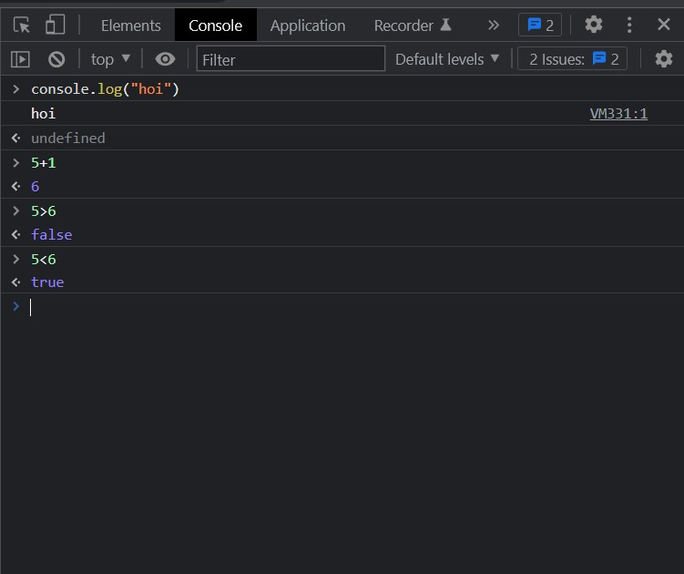
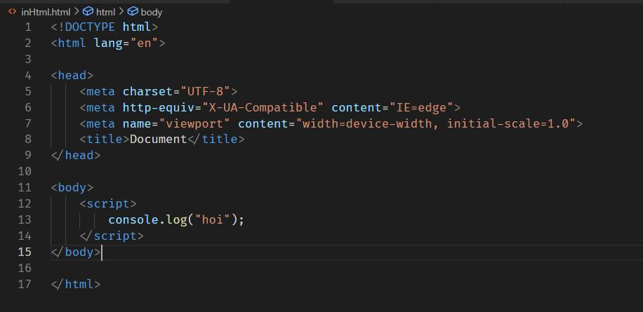
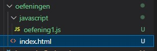
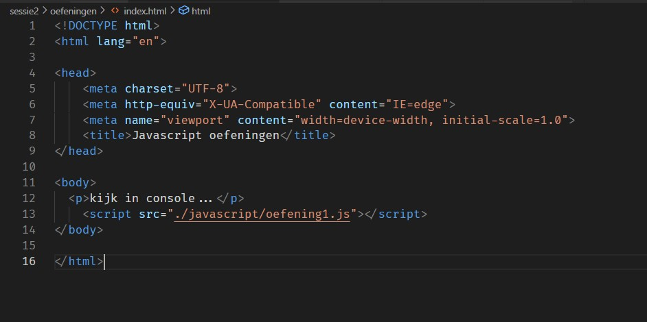

# STEAM-clubs 2022-2022 Web Development
Deze tutorial is bedoeld voor de deelnemers van de Web Development reeks van de STEAM-clubs in het schooljaar 2022-2023.
# Sessie 2: Javascript basics
## Wat is Javascript?
Javascript is een programmeertaal die gebruikt wordt voor websites te maken. Kort gezegd: html zorgt voor de structuur, de inhoud, css zorgt voor de layout, kleurtjes,... En javascript zorgt er voor dat je iets meet je website kan doen. 

We gaan in deze reeks een aantal oefeningen maken om de basis van javascript onder de knie te krijgen. Je kan hiervoor de bestanden gebruiken die mee geleverd zijn. 

## Het begin

In je browser klik op f12. Je ziet nu een venster verschijnen. Dit is de console. Hier kan je javascript code typen en uitvoeren. 



Je kan hier dus enkele korte lijntjes code uitvoeren. Bijvoorbeeld om vlug iets te proberen.

## HTML met Javascript
Om javascript uit te voeren zijn verschillende opties. 



Je kan javascript code in je html zetten. Dit is niet de beste manier om het te doen. Het is veel beter om een apart bestand te maken met de javascript code.

Dit gaan we vanaf nu ook doen. 
Hiervoor ga je in de HTML een script tag gebruiken met een src attribuut. 
Stel we hebben een `index.html` bestand en een `oefening1.js` bestand dat bestand staat in een javascript mapje.  


In de index.html zet je dan volgende code:
`<script src="javascript/oefening1.js"></script>`


Je moet dat lijntje code toevoegen vlak voor de `</body>` tag.

## Oefening 1
Maak een nieuw bestand aan met de naam `oefening1.js`. Zet dit bestand in een map die je `javascript` noemt. Maak dan de html code zoals hierboven. 

### Console.log

In de console kan je met de functie `console.log()` een lijntje tekst uitprinten.
Dit is bij grotere programma's ook zeker handig voor debugging. Schrijf eens een paar lijntjes code. Te beginnen met "Hello world". 
Bijvoorbeeld:  
```js
console.log("Hallo World!");
console.log("Nog een tekstje");
```
Kijk daarna in de console. Je ziet nu de tekst verschijnen.

### alert
Een leuke om te doen is de `alert()` functie. Deze functie toont een pop-up venster met een tekst. 
```js
alert("hello world!");
```

Wat gebeurt er? Bekijk het even!

### Comments
In javascript kan je ook comments schrijven. Dit zijn stukjes tekst die niet uitgevoerd worden. Dit is handig om te weten wat je code doet. 
```js
// 1 lijn commentaar
console.log("commentaar uitvoeren");
/*
Meerdere
lijnen
commentaar
*/
```
## Variabelen

Variabelen zijn een manier om informatie op te slaan. Je kan een variabele zien als een doosje waar je iets in kan stoppen. Een soort van label met een waarde. 
Er zijn twee soorten variabelen `let` en `const`.	

### let 
Met `let` kan je een variabele aanmaken. Je kan deze variabele dan later aanpassen. 
Volgende code zal eerst een variabele maken met naam 'Jef'. Dan printen we die naam om vervolgens de naam aan te passen naar 'Jefke' en opnieuw te printen. Probeer maar eens!

```js
let naam = "Jef";
console.log(naam);
naam = "Jefke";
console.log(naam);
```

### const
Met `const` kan je een variabele aanmaken. Je kan deze variabele niet aanpassen. 
en dus enkel op roepen.
```js
const naam = "Jef";
console.log(naam);
naam = "Jefke";
console.log(naam);
```
De bovenstaande code zal niet werken. Aangezien je dus `naam` in dit geval niet kan aanpassen, aangezien het een const is. const = constante.

Best maak je al je variabelen const tenzij het niet anders kan.
### naamgeving
Je kan een variabele een naam geven die je zelf wil. Je mag geen spaties gebruiken. Je mag wel hoofdletters gebruiken. Ook cijfers kunnen gebruikt worden, maar niet als eerste letter. 
Best gebruik je ook camelCasing. Dat is wanneer je een woord aan elkaar plakt en met uitzondering van het eerste woord, elk woord begint met een hoofdletter. Bijvoorbeeld: welkomBijDeSteamClubs. Gebruik zinvolle namen. Dus niet `a` of `b` maar `leeftijd` of `naam`.	

## Datatypes
In javascript heb je verschillende datatypes. We gaan er niet heel diep op ingaan maar je kan best een kijkje nemen op: https://javascript.info/types. We gaan ze dus even gebruiken zonder uitleg, uiteraard als je verder gaat met web development is het wel goed als je er meer over te weten komt.